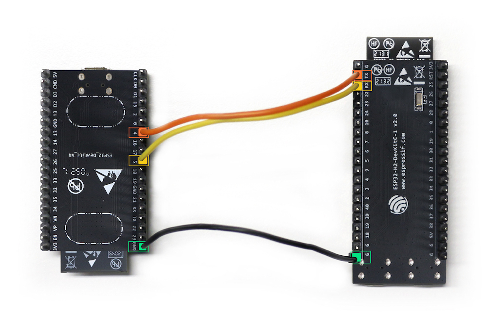

# Zigbee Bridge

This example demonstrates a Matter-Zigbee Bridge that bridges Zigbee devices to Matter fabric.

The Matter Bridge device is composed of two parts: The RCP running on
ESP32-H2 and the bridge app running on ESP32.

See the [docs](https://docs.espressif.com/projects/esp-matter/en/latest/esp32/developing.html) for more information about building and flashing the firmware.

## 1. Additional Environment Setup

### 1.1 Hardware connection

Connect the two SoCs via UART, below is an example setup with ESP32
DevKitC and ESP32-H2 DevKitC:



|  ESP32 Pin  | ESP32-H2 Pin |
|-------------|--------------|
|   GND       |    GND       |
|   GPIO4     |    GPIO7     |
|   GPIO5     |    GPIO8     |

### 1.2 Build and flash the RCP (ESP32-H2)

```
cd ${IDF_PATH}/examples/zigbee/esp_zigbee_rcp/
idf.py --preview set-target esp32h2
idf.py -p <port> build flash
```

The Matter Bridge will run on the ESP32 and Zigbee network will be
formed.

## 2. Post Commissioning Setup

### 2.1 Discovering Zigbee Devices

You can read the parts list from the Bridge to get the number of the
bridged devices.

```
chip-tool descriptor read parts-list 0x7283 0x0
```

If there is no other Zigbee device on the Zigbee Network, you will get
an empty result. Example:

```
Data = [

],
```

### 2.2 Setup Zigbee Bulb on ESP32-H2

Build and run Zigbee Bulb app on another ESP32-H2 board.

```
cd ${IDF_PATH}/examples/zigbee/light_sample/light_bulb
idf.py --preview set-target esp32h2
idf.py -p <port> build flash monitor
```

The Zigbee Bulb will be added to the Zigbee Network and a dynamic
endpoint will be added on the Bridge device. You can read the parts list
again to get the dynamic endpoint ID.

```
chip-tool descriptor read parts-list 0x7283 0x0
```

The data will now contain the information of the connected Zigbee
devices. Example:

```
Data = [
    1, 
],
```

It means that the Zigbee Bulb is added as Endpoint 1 on the Bridge
device. You can read the cluster servers list on the dynamic endpoint.

```
chip-tool descriptor read server-list 0x7283 0x1
```

This will give the list of supported server clusters. Example:

```
OnDescriptorServerListListAttributeResponse: 4 entries
    [1]: 6
    [2]: 29
    [3]: 57
    [4]: 64
```

### 2.3 Control the bulb with chip-tool

Now you can control the Zigbee bulb using the chip tool.

```
chip-tool onoff toggle 0x7283 0x1
```

## 3. Device Performance

### 3.1 Memory usage

The following is the Memory and Flash Usage.

-   `Bootup` == Device just finished booting up. Device is not
    commissioned or connected to wifi yet.
-   `After Commissioning` == Device is connected to wifi and is also
    commissioned and is rebooted.
-   device used: esp32c3_devkit_m
-   tested on:
    [bd951b8](https://github.com/espressif/esp-matter/commit/bd951b84993d9d0b5742872be4f51bb6c9ccf15e)
    (2022-05-05)

|                         | Bootup | After Commissioning |
|:-                       |:-:     |:-:                  |
|**Free Internal Memory** |109KB   |105KB                |

**Flash Usage**: Firmware binary size: 1.26MB

This should give you a good idea about the amount of free memory that is
available for you to run your application's code.
